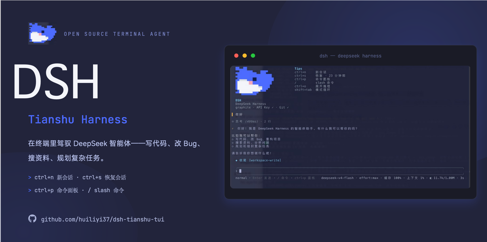

# dsh-tianshu-tui — Terminal UI for DeepSeek Harness

[](https://www.npmjs.com/package/@huiliyi37/dsh-tianshu-tui)
[](LICENSE)
[](https://www.npmjs.com/package/@huiliyi37/dsh-tianshu-tui)
[](https://github.com/huiliyi37/dsh-tianshu-tui/releases)

[中文](README.md) | English



**dsh-tianshu-tui** (`@huiliyi37/dsh-tianshu-tui`) is the interactive terminal UI plugin for the official [DeepSeek Harness](https://github.com/deepseek-ai/deepseek-harness). The render core is a self-built minimal ANSI engine (evolved from the author's own open-source [Tianshu-Tui](https://github.com/huiliyi37/Tianshu-Tui), Apache-2.0; file-by-file provenance in [SOURCE-MAP.md](SOURCE-MAP.md)), keeping rendering lightweight and non-intrusive. The UI is a pure presentation layer: every piece of agent state arrives through the session event stream. On top of it, the plugin adds harness-level engineering niceties such as image & vision bridging, smart code retrieval, and memory with cross-session recall.


> [!WARNING]
> **Ecosystem boundary**: this plugin belongs to the official [DeepSeek Harness](https://github.com/deepseek-ai/deepseek-harness) ecosystem (`@deepseek-ai/*` scope) — its peerDependencies and imports all point at `@deepseek-ai/*`. **Do not assemble it into an oh-my-tianshu (`@huiliyi37` scope, CLI `@huiliyi37/dsh-tianshu`) tui profile.** oh-my-tianshu ships its own official TUI, `@huiliyi37/dsh-tui`: the two share 109 of 117 TUI source files but live in different ecosystems. Mixing them makes the plugin resolve `@deepseek-ai/*` at runtime through stale symlinks under `~/.dsh/profiles/node_modules` pointing at the globally installed official dsh — a fragile cross-ecosystem coupling.

## Documentation

| Doc | What it covers |
|---|---|
| [Getting started](docs/getting-started.en.md) | Install, launch, and troubleshooting |
| [Interaction](docs/interaction.en.md) | Full keymap and command reference |
| [Configuration](docs/configuration.en.md) | Assembly options, env vars, runtime config |
| [Architecture](docs/architecture.en.md) | Layers, data flow, design decisions |
| [Themes](docs/themes.en.md) | The 16 built-in palettes and custom themes |
| [Plugin ecosystem](docs/plugins.en.md) | Companion plugins and extension points |
| [VS Code](docs/vscode.en.md) | Running inside VS Code |
| [ADAPTER.md](ADAPTER.md) | TUI ↔ harness boundary contract |
| [Contributing](CONTRIBUTING.en.md) | PR guidelines and the verification matrix |
| [Developing](DEVELOPING.md) | Structure, build, release |

## Install

This package is not a standalone app. You need the official CLI [`@deepseek-ai/dsh`](https://www.npmjs.com/package/@deepseek-ai/dsh) (npm `latest`, currently `0.1.1-rc.2`; needs ≥ `0.1.0-rc.8`, aligned with the peer deps). `npm i` of this package alone will not run.

**One-click install (recommended)**: the repo ships cross-platform scripts that detect Node/pnpm, install the official CLI via pnpm, wire this plugin and launch (defaults to the npmmirror registry for CN networks):

```sh
# macOS / Linux (bash)
bash <(curl -fsSL https://raw.githubusercontent.com/huiliyi37/dsh-tianshu-tui/main/scripts/install-tui.sh)
# install only, no launch:
bash <(curl -fsSL https://raw.githubusercontent.com/huiliyi37/dsh-tianshu-tui/main/scripts/install-tui.sh) --no-launch

# Windows (PowerShell)
powershell -ExecutionPolicy Bypass -Command "irm https://raw.githubusercontent.com/huiliyi37/dsh-tianshu-tui/main/scripts/install-tui.ps1 | iex"
# install only, no launch (after cloning the repo):
powershell -ExecutionPolicy Bypass -File scripts\install-tui.ps1 -NoLaunch
```

### 1. Prerequisites

- [Node.js](https://nodejs.org/) `^22.19 || >=24`
- [`pnpm`](https://pnpm.io/installation) on PATH (`dsh plugin` forwards to it; if missing, `corepack enable` — Node ships corepack)

> ⚠ **npm 11 OOM pitfall**: the official CLI `@deepseek-ai/dsh` has a large dependency tree (60+ sub-packages); **npm 11 (bundled with Node 24) runs out of heap while installing it** (hangs for minutes then `JavaScript heap out of memory` — reproduced). Use pnpm (commands below). If you are already on `npx -y @deepseek-ai/dsh` and it hangs/throws heap OOM, switch to pnpm.

**Do not type `dsh` by itself.** An older `dsh` on PATH (for example `~/.local/bin/dsh`, where `dsh --version` is below `0.1.0-rc.8`) will hit a local staging tree and fail with `ERR_FS_EISDIR` / `Path is a directory .../@deepseek-ai/dsh`. Always use the `pnpm dlx` commands below.

### 2. Add this plugin to the tui profile

```sh
pnpm dlx @deepseek-ai/dsh plugin --profile tui add @huiliyi37/dsh-tianshu-tui
```

pnpm may warn about missing peers; ignore that. Peers come from the official `dsh` host. Without pnpm you can also use `npx -y pnpm dlx @deepseek-ai/dsh plugin --profile tui add @huiliyi37/dsh-tianshu-tui`.

After an npm install, each launch checks npm `latest` and writes a newer version into the profile, then asks you to restart. You can also run `/update` inside the TUI for a manual check (check-only; it prints the update command). Set `DSH_TUI_SKIP_UPDATE=1` to skip the check. `github:` / `link:` installs are left alone.

You can also install from Git: `pnpm dlx @deepseek-ai/dsh plugin --profile tui add github:huiliyi37/dsh-tianshu-tui` (the repository ships `lib/index.js`; no rebuild).

### 3. Start

```sh
pnpm dlx @deepseek-ai/dsh --profile tui
```

Success looks like a welcome screen branded **dsh-tianshu-tui**. Quit with `Ctrl+Q` or `/exit`.

If the official CLI is installed globally (`pnpm add -g @deepseek-ai/dsh`) and `dsh --version` is at least `0.1.0-rc.8`, you can use `dsh` in place of `pnpm dlx @deepseek-ai/dsh`.

### 4. (Optional) Enable agent presets (`/preset`)

`/preset` lists/switches agent presets (standard / PTC / minimal / creative). It needs the official `@deepseek-ai/dsh-agent-presets` plugin, which the official dsh does not ship by default — install it explicitly:

```sh
pnpm dlx @deepseek-ai/dsh plugin --profile tui add @deepseek-ai/dsh-agent-presets@0.1.1-rc.2
```

> ⚠ Pin `@0.1.1-rc.2` explicitly: the official npm `latest` tag still points at the outdated `0.0.1-rc.1` (`@latest` would install the old one). Without the plugin, `/preset` reports 「⚠ agent-presets 服务不可用（host 未装配 agent 预设）」 — install it and restart.

Usage:

- `/preset` — list all presets with the current one marked (`*`), plus the current wire tool surface
- `/preset <id>` — switch to the given preset (blank sessions only: `/session new` first)

If `npx` still raises `ERR_FS_EISDIR`, stale install fallbacks under `~/.dsh/profiles/node_modules` are colliding with the official CLI. Use a clean home:

```sh
DSH_HOME=/tmp/dsh-tianshu pnpm dlx @deepseek-ai/dsh plugin --profile tui add @huiliyi37/dsh-tianshu-tui
DSH_HOME=/tmp/dsh-tianshu pnpm dlx @deepseek-ai/dsh --profile tui
```

Do not run tsdown for this package from the DeepSeek Harness workspace root: it rewrites imports to unpublished `@deepseek-ai/dsh-root`, and loading fails.

## Coexisting with other distributions

This plugin runs on top of the official DeepSeek Harness (`@deepseek-ai/dsh`) and uses the
official home `~/.dsh`. The standalone integrated distribution **oh-my-tianshu** (formerly
tianshu-public, `@huiliyi37/dsh-tianshu`, a full harness with its own `tianshu` CLI) is a
separate distribution line that uses its own `$DSH_HOME` (`~/.dsh-tianshu` once the
default-home isolation lands) — the two homes are isolated, so both can be **installed side
by side without conflicts** (sessions / profiles / settings stay separate). To coexist, set
`export DSH_HOME=~/.dsh-tianshu` on the tianshu side.

**Naming memo (avoid confusion):**

| Name | What it is |
|---|---|
| `dsh-tianshu-tui` (this plugin) | The TUI plugin for the official dsh (this repo) |
| `oh-my-tianshu` / `@huiliyi37/oh-my-tianshu` (formerly tianshu-public) | Standalone integrated distribution with its own CLI (`oh-my-tianshu`) |
| `Tianshu-Tui` (upstream) | Apache-2.0 source of this plugin's render core |

> Renamed on 2026-08-16: the former `@huiliyi37/dsh-tianshu` (command `tianshu`) is now
> uniformly `@huiliyi37/oh-my-tianshu` (command `oh-my-tianshu`), matching the repo name;
> the old package is deprecated — migrate your install.

The companion vision plugin lives in `vision-ask/` if you need image re-interrogation.

## Release notes

Current npm `latest`: [`@huiliyi37/dsh-tianshu-tui@0.1.2-rc.18`](https://www.npmjs.com/package/@huiliyi37/dsh-tianshu-tui) ([GitHub Release](https://github.com/huiliyi37/dsh-tianshu-tui/releases/tag/v0.1.2-rc.18)).

### Unreleased (main)

- **Glance context bar** — `上下文 N%` is followed by an 8-cell used/free bar (`▓`/`░`; ASCII fallback `[====----]`)
- **`/session` calendar groups** — picker and `/session list` group into today / yesterday / this week / earlier; ↑↓ skip group headers
- **OS notifications** — desktop bubbles when a subagent, workflow, or background task finishes (not on `turn/end`); silenced under `DSH_TUI_SKIP_NOTIFY`, SSH, CI, and tests
- **`/config` terminal section** — system-notify toggle at the top (empty-input `n` or `/config notify [on|off]`, persisted in `prefs.json`); empty host sections are omitted; the toggle still works when host settings/permission/credentials are missing

### 0.1.2-rc.18 (2026-08-26)

Todo card leaves the thinking zone: it sits above the input rail and lists items by default.

- **Todo card above the input rail** — moved from above glance/thinking into chrome (below the activity band, above question/approval/input); small windows no longer crop it when trimming the live top, and it no longer fights thinking for attention
- **Default item list** — when work is open, a count header plus items (in-progress first), up to 5, then `└ …(+N)`; all-completed stays one line; `/todos all` shows the full list without the cap. The count header no longer appends `· current item`

### 0.1.2-rc.17 (2026-08-25)

Activity band + startup-default semantics: subagents/workflows move to a unified activity band, startup items split into "this session" vs "write default", todos auto-pop on first write, `/fork` `/branch` fixed.

- **Unified activity band for subagents/workflows** — the area above the input rail defaults to a single activity band (`◐ N subagents · M workflows`): one stats line per running item (capped at `activityBandMaxRows`, default 5, folded to `+N`), a subagent collapses to `✓ {label} · N tools · X tok · 12s` on finish, a workflow submits a summary line when done; `activityBand: false` falls back to one spinner line per running subagent. The `/subagents` live card shows the second running line and failure state, appending "⤷ external subagent" when the host has external runs; the `/workflow` roster appends the child-session label / run state when a childId hits the delegation tree
- **Startup items split into "this session" vs "write default"** — picker Enter / argument commands only hot-switch the current session; pressing `S` in a picker or appending `default` to a command writes `prefs.json` as the startup default for new sessions (`/theme` `/model` `/effort` `/density` `/preset`); echoes spell out the difference so defaults and session-scoped changes are no longer confused
- **First todo write auto-opens the compact card** — live no longer draws the todos projection by default; the first non-empty todo write by the model auto-opens the compact card, and closing it or `/clear` disarms auto-open for the rest of the session
- **`/fork` `/branch` fix** — they now mint a child once via `agents.create({ seed })` instead of resuming a live child session (official `persistence.prepare` throws `cannot prepare while it is live` for in-memory sessions; fork previously blew up)

### 0.1.2-rc.16 (2026-08-25)

`/preset` inject-fallback release.

- **`/preset` no longer throws `without inject` ([#46](https://github.com/huiliyi37/dsh-tianshu-tui/issues/46))** — when the official `@deepseek-ai/dsh-agent-presets` plugin is not installed, the command reads the optional service via `reflect.get('agentPresets', false)` and prints "service unavailable" instead of `cannot get property "agentPresets" without inject` (same pattern as `/compact` `/goal`); the tracked `lib/index.js` bundle is synced, so `github:` installs get the fix too. To enable presets: `pnpm dlx @deepseek-ai/dsh plugin --profile tui add @deepseek-ai/dsh-agent-presets@0.1.1-rc.2` (npm `latest` still points at stale `0.0.1-rc.1`; pin the version)

### 0.1.2-rc.15 (2026-08-25)

Manual update + startup session reuse.

- **`/update` manual update check** — checks npm `latest` without installing: shows the version pair and a manual update command when newer (or restart for the startup self-update), reports the current version when up to date, and surfaces the failure reason on network errors (never throws). Bypasses `DSH_TUI_SKIP_UPDATE` (an explicit check request overrides "do not phone home") and reuses the startup self-update's 1h cache pipeline
- **Startup empty-session reuse (community PR #45)** — when the live store is empty the plugin reuses the most recent content-less session id instead of minting a new one each launch, rebinding `header.cwd` to the launch directory; stale artifacts are cleared before rebuild (cross- or same-directory) to dodge the backend adopt prefix check
- **`/session` picker summaries (community PR #45)** — the no-arg picker shows summary rows (`#short-id · title · relative age`; title = title-event fold → first human message → 「新对话」); `/session list` keeps the old plain printout
- **Real-machine e2e assets (community PR #45)** — `scripts/e2e-tui.{sh,exp}` + `npm run e2e:tui`: expect drives the official dsh CLI in a pty (isolated DSH_HOME), covering startup reuse (incl. the adopt-error regression) and both /session forms
- **README install-section fix** — install commands no longer pin the host CLI to `@0.1.0-rc.8` (npm `latest` is now `0.1.1-rc.2`); commands use no version (peer deps `^0.1.0-rc.8` are compatible)

### 0.1.2-rc.14 (2026-08-25)

tianshu-public interaction-surface backport: provider API-key configuration + image send preview + format-layer additions (three waves).

- **`/key` `/login` configure model-provider API keys** — supplier picker (default first, `✓` when configured) → masked input (≤8 shown as `•`, longer reveals last 4) → online probe (ok persists / invalid rejected back to input / unknown may force-save) → effective immediately (no restart; welcome line and footer API badge refresh live); `llm-deepseek` routes probe the official endpoint, pi-ai routes auto-write their profile after save so the route registers instantly; env-shadowed (`writable=false`) and missing-credentials deployments get dedicated explainer states; first launch without a key auto-opens once on TTY (Esc to skip)
- **Image send preview (half-block thumbnails)** — attaching an image shows a downsampled truecolor preview of the last one above the input rail (run-length merged, async decoding); terminals without a graphics protocol get a half-block fallback in scrollback after sending (every line is a real scrollback row, no ghosting); sharp is lazy-loaded and failures degrade silently to text
- **Format-layer additions** — unified activity band (`format/activity-band`: folds subagent/workflow/background-task sources, group counts, `⎿` subline, capped folding) and message-surface background fill (`format/bg-block`) land as pure functions, ready for wiring
- **Backport baseline** — the 22 upstream commits after the 8-22 cutoff hold no portable tui content (intent-bridge ships disabled = matches this repo); the four host seams (llm directory / discoverModels / credentials.set / settings.mutate) verified against the installed host

### 0.1.2-rc.10 (2026-08-16)

One-step updates + Windows/PowerShell compatibility + command-input tolerance.

- **Auto-restart after update ([#34](https://github.com/huiliyi37/dsh-tianshu-tui/issues/34))** — once the startup self-update lands, the process restarts automatically (only when the session hasn't started working; otherwise it just prompts and never interrupts). `/restart` restarts the process in place (no more `/exit` + manual relaunch)
- **Package-manager-aware self-update** — profiles managed by pnpm/npm/yarn each use their own installer; no more hardcoded `pnpm add` (npm/yarn users no longer get a stray `pnpm-lock.yaml`)
- **`/help` fixed ([#36](https://github.com/huiliyi37/dsh-tianshu-tui/issues/36))** — it used to fail with `cannot get property "tui" without inject`; now it lists every command via the command factory deps
- **Tab command menu ([#31](https://github.com/huiliyi37/dsh-tianshu-tui/issues/31) follow-up)** — with an empty input, Tab pops the full command menu; Enter runs the selected command directly (`/model` `/theme` `/session` open their pickers) — no need to type the command name (Claude Code style)
- **Windows/PowerShell compatibility** — Ctrl+C interrupt no longer loses the input box (0x03 byte + SIGINT double-trigger dedup, dual SIGINT registration, exit-time terminal restore)
- **`/`-prefixed path tolerance** — `/src/main.ts`, `~/xxx`, Windows drive paths (`C:\...`) are no longer mistaken for slash commands and rejected as "unknown command"
- **Interrupt recovery hardening** — abort now force-releases full-screen overlays (command palette/search etc.), so the input rail always comes back next frame; regression tests added for input-box visibility after interrupt

Users already on `0.1.x-rc.6` pick this up on the next launch. Restart after you see `插件已更新到 …，请重启 dsh 后生效` (or the new version restarts automatically; `/restart` works too).

### 0.1.2-rc.9 (2026-08-16)

Interaction overhaul: Esc interrupt + double-Esc rewind, session tab bar, cost summary, live theme preview.

- **Dual Esc semantics (aligned with Claude Code)** — a single `Esc` interrupts an in-flight reply (same path as Ctrl+C, 80ms debounce); when idle, `Esc`+`Esc` (1s window) opens the **rewind panel**
- **Rewind timeline UI** — the message list is now a timeline: type marks (❯ user / ✦ assistant) + relative time + turn separators + a scroll window that follows the selection (older messages reachable)
- **Session tab bar** — with multiple sessions, a persistent tab row sits above the input rail (current marked ●, narrow widths fold into `+N`); `Ctrl+X` cycles, `Alt+1`~`Alt+9` jumps
- **`/cost` session cost summary** — usage accumulates per model, printing per-model detail (input/cache-read/write/output/reasoning) plus a total $ estimate
- **Live theme preview** — the `/theme` picker switches the theme as you move ↑/↓, Enter settles, Esc restores
- Engineering: the `lib` bundle is rebuilt and tracked with this release

Users already on `0.1.x-rc.6` pick this up on the next launch. Restart after you see `插件已更新到 …，请重启 dsh 后生效`.

### 0.1.2-rc.8 (2026-08-16)

Interactive pickers, Claude Code benchmark improvements, workflow observation surface, and an audit fix.

- **Interactive pickers ([#31](https://github.com/huiliyi37/dsh-tianshu-tui/issues/31))** — `/theme`, `/model`, `/session` with no arguments now open a picker: ↑/↓ (or j/k) to select, PageUp/PageDown to page, Enter to confirm, Esc to close, with the current value marked ●; the model list comes from the llm directory, and argument forms are unchanged
- **Cost and context watermark** — the footer now shows a $ cost estimate (built-in flash/pro pricing table; unknown models are not guessed) and prefixes ⚠ to the context usage segment at ≥95%
- **Git dirty indicator** — footer shows `●N` (uncommitted-file count, refreshed at turn boundaries)
- **`/help` command** — a registry-driven list of every command (`/help <cmd>` for one entry's detail)
- **Manual tool-card expansion** — Enter on an empty input toggles the last in-flight tool card, expanding its argument JSON
- **Workflow panel observation surface** — running time now renders real elapsed (was a raw timestamp), meta is completed (run name/description/phase count), and `workflow/log` narration lines appear in the expanded view
- **Audit fix ([#30](https://github.com/huiliyi37/dsh-tianshu-tui/issues/30))** — `dsh.runtime: "host"` declared and all 4 subprocess calls converted to fixed-argv forms (execSync → execFileSync)
- Engineering: the `lib` bundle is rebuilt and tracked with this release

Users already on `0.1.x-rc.6` pick this up on the next launch. Restart after you see `插件已更新到 …，请重启 dsh 后生效`.

### 0.1.2-rc.7 (2026-08-15)

A functionality-audit overhaul: the vision bridge is detectable, missing services no longer fail silently, and the projection layer now powers a per-turn summary line; platform degradations are all visible.

- When the primary model cannot see images and no `vision` config was injected, the TUI now auto-detects a host `visionBridge` service (contract in the Assembly section)
- Missing goal/subagent plugins no longer prevent the entire TUI from silently never starting (goals/subagents are optional services now)
- The `/tasks` `/subagents` `/workflow` `/status` `/config` `/skills` panels and plan mode echo a ⚠ warning when their backing service is absent, instead of going blank without a word
- `/clear` actually clears the screen (it previously only reset the internal buffer); the `Ctrl+.` keymap panel is complete at 20 entries and a narrow-width overflow is fixed
- Projection layer wired: a dim `turn N · 读X 改Y · elapsed` summary line lands at turn end, and `/status` gains a session-totals section that works even without the host projection service
- Platform degradations are now visible: missing clipboard-image toolchain, external-editor spawn failure, OSC52-incapable terminals, and self-update failures all produce an explicit notice
- Fixes: pending approvals/questions settle correctly on session switch and exit; fiber remount no longer throws DUPLICATE_PROVIDER (composition tests guard both)
- Engineering: two-stage build (tsc → tsdown, no more stale-artifact repackaging), a typecheck gate, CI, and vision-ask realigned to the rc.6 type surface

Users already on `0.1.x-rc.6` pick this up on the next launch. Restart after you see `插件已更新到 …，请重启 dsh 后生效`.

### 0.1.2-rc.6 (2026-08-14)

Quitting restores the terminal cursor and gives the TTY back to the shell. New `/exit` command.

- `Ctrl+Q` / `/exit` show the hardware cursor again and exit the host so the shell can take the TTY ([#22](https://github.com/huiliyi37/dsh-tianshu-tui/issues/22))
- The TUI no longer hangs silently when launcher host services are missing
- Full-screen overlays are no longer overwritten by streamed output; Esc/Ctrl+C closes the command palette without committing
- Idle empty Ctrl+C requires a double-press to quit; the waiting hint no longer fires after a completed turn

Users already on `0.1.1-rc.6` pick this up on the next launch. Restart after you see `插件已更新到 …，请重启 dsh 后生效`.

### 0.1.1-rc.6 (2026-08-14)

On launch the plugin checks npm `latest`, writes a newer version into the profile, and asks you to restart.

**Upgrading from `0.1.0-rc.8`:** that build has no self-update. Add the plugin once more to pick up the new logic:

```sh
npx -y @deepseek-ai/dsh plugin --profile tui add @huiliyi37/dsh-tianshu-tui
npx -y @deepseek-ai/dsh --profile tui
```

Later releases write themselves into the profile on launch. Restart after you see `插件已更新到 …，请重启 dsh 后生效`. Set `DSH_TUI_SKIP_UPDATE=1` to skip the check. `github:` / `link:` installs are left alone.

This release also includes display-layer fixes already on `main`:

- New sessions write `meta.cwd`, so the Web UI can list TUI sessions
- Welcome / status line judge the API key via credentials
- After `/model`, the footer glance and vision capability follow the real model
- `Ctrl+S` can restore a session from disk

The first public baseline is recorded in [docs/BASELINE-v0.1.0-rc.8.md](docs/BASELINE-v0.1.0-rc.8.md).

## Highlights

- **Full session workspace in a terminal** — live rendering, append-only scrollback, session restore on startup, `/fork` exploration branches, `/rewind` rollback (session truncation + optional file rollback), `/export` to Markdown transcripts, and mid-turn steering (`/steer` / `Ctrl+T`).
- **End-to-end images** — paste from clipboard (`Ctrl+V` / terminal-menu paste), render as inline terminal graphics (kitty / iTerm2), deliver through the harness attachment service, and let a vision-capable model actually see them — with an automatic vision bridge that describes the image through a separate vision model when the main model cannot see.
- **A complete input surface** — grok-style slash dropdown menu (fuzzy prefix matching, MRU ordering, ghost previews), `@`-path Tab completion and `@mention` expansion, bracketed paste, optional vim keybindings, external editor (`Ctrl+E`), history search (`Ctrl+F`) — and a full keymap overlay behind `Ctrl+.`.
- **In-terminal interaction surfaces** — structured question panels (numeric selection, plan-review feedback mode), pending approval cards with inline `diff` previews, mode cycle (`Shift+Tab`: normal → plan → always-approve), command palette, and live panels for status / config / skills / tasks / delegation / workflow.
- **Reasoning made visible** — the think channel streams as a live header, folds into a compact scrollback line (`✻ 思考 (3.2s) · 12 行`), and expands in place with `Ctrl+O` (competitor-aligned: collapsed by default).
- **Personalized harness integrations** — `/doctor` terminal diagnostics, `/memory` project-memory browser, `/btw` side questions to a background agent, `/model` + `/effort` hot-switching that takes effect on the current session immediately.
- **Auditable by construction** — the TUI registers no prompt, tool, or context surface of its own; user input becomes ordinary logged messages, and every rendered state derives from session events.
- **Co-evolved with the harness** — built in lockstep with harness-side capabilities on the 2026-08-09 baseline snapshot (250+ commits): the image/vision pipeline, DeepSeek Spark model engineering, session persistence and file snapshots, memory, the validation gate and failure routing, code intelligence, and the git tool. See the next section.

## Co-evolved harness capabilities (since the 2026-08-09 baseline)

The terminal UI evolved from [Tianshu-Tui](https://github.com/huiliyi37/Tianshu-Tui) (Apache-2.0; per-file provenance in [SOURCE-MAP.md](SOURCE-MAP.md)). This bundle then developed in lockstep with harness-side work on the DeepSeek Harness baseline snapshot `snapshots/20260809T140917Z` — 250+ commits between 2026-08-10 and 2026-08-13. The capabilities below live in the host harness (separate packages, not shipped in this bundle); the TUI is their primary interactive surface:

- **Image pipeline & vision bridge** — the `image` ContentBlock joins the merge-extensible content vocabulary and `dsh-llm-deepseek` serializes user image blocks as OpenAI-style `image_url` content parts, so user images reach the wire end-to-end (clipboard → input line → session → model request). Models declare `supportsVision` (`LlmModelInfo` + llm-deepseek catalog). `dsh-vision-bridge` covers text-only main models: at `agent/pre-step` it describes image attachments through a separate vision model (`visionAutoBridge` auto-selects the first vision-capable model when provider/model are omitted; fallback model + data URL validation; the prompt auto-selects between general structure and OCR-level transcription based on UI/error keywords), injecting the description as a plugin-source user message — Model-visible ⟺ logged; bridge failure degrades to a visible hint, never a failed turn.
- **DeepSeek Spark aliases** — the official API has no `spark` model and this host does not register a `deepseek-spark` provider. `/model spark-flash` / `spark-pro` map onto the registered `deepseek-official` route with wire ids `deepseek-v4-flash` / `deepseek-v4-pro`.
- **Session persistence & file snapshots** — `Session.truncate` rewinds the event log and resets derived state; persistence backends gained `deleteFrom` plus a truncate coordinator, so rollback survives reload; `dsh-fs-snapshot` ports FileHistory (trackEdit / rewindToBoundary) and snapshots before write-tool execution. TUI surface: `/rewind` (conversation truncation + optional file rollback).
- **Memory** — `dsh-memory` (MemoryService + Markdown file backend, non-git fallback) and `tool-memory` (`memory_save` / `memory_search` + memory-digest injection) provide cross-session recall. TUI surface: `/memory`, `/remember`.
- **Validation gate & failure routing** — `dsh-evidence-gate` enforces RED-first verification: obligation state machine, edit/verify counters, TDD gate (`enforce` mode), probe suggestions with cooldown, and an L2 final-review gate, natively wired into `str_replace_editor` and the headless-agent assembly. `dsh-agent-router` predicts step failure from turn history and routes work — verification-subagent dispatch and per-profile tool restriction — with real-turn e2e coverage.
- **Code intelligence & retrieval** — `dsh-semantic-index` (BM25 + salience/RRF/vector fusion, incremental updates) exposed as the `semantic_search` tool; `dsh-meridian` code index (node:sqlite schema, tree-sitter parsers for TypeScript/Python/Go, graph/impact/flow queries, behavioral signals, background backfill) exposed as `repo_graph` and the `<codebase-index>` digest; `dsh-pheromone` file-level pheromones with atomic JSON persistence, surfaced through `file_info` and the read tool's `focus` semantics.
- **Git service & tool** — `dsh-git` service seam (GitLocal CLI provider, service-class-as-plugin) plus `dsh-tool-git`, a single model-facing git tool with an operation discriminator (status / diff / log / commit), assembled in the base bundle.

## Features

### Session management

| Capability | Description |
|---|---|
| `/session new\|list\|switch` | Create, list, and switch sessions; resume replays the full transcript through the same render bridge |
| Restore panel | Recoverable sessions are listed in scrollback at startup |
| `/fork [directive]` · `/branch` | Fork the current session (history copied to a new child session) and optionally start it with a directive |
| `/rewind` | Roll back to a chosen message — conversation truncation and/or file rollback to the pre-boundary snapshot |
| `/export` | Export the current session transcript to a Markdown file |
| `/clear` | Clear the scrollback view of the current session |

### Input surface

- **Slash command menu** — typing `/` opens a dropdown with fuzzy prefix matching, `↑↓` / `PageUp` / `PageDown` selection, `Tab` accept, `Enter` submit, MRU ordering, argument-placeholder ghosts, and an input-line ghost preview.
- **Clipboard & image paste** — `Ctrl+V` reads a clipboard image (falling back to text); terminal-menu paste detects images; pasted paths that look like images are loaded as attachments; `Alt+W` / vim yank copies selection to the system clipboard via OSC52.
- **Image submission** — attached images show a `📎 N images` marker, render inline under the user bubble on submit, and reach the model through the attachment service; the bubble carries a vision hint (forwarded / bridged via a vision model / not sent). Oversized pastes are adaptively compressed before send: 1568px long-edge clamp (PNG keeps transparency), degrading JPEG 0.82 → 0.55 → 1024px + 0.55 until under the provider cap, never upscaling.
- **Editing** — vim keybindings (optional), external editor (`Ctrl+E`), Tab file completion, `@mention` expansion, input history, multi-line input, and bracketed paste (multi-line / long pastes land in the input line as one block instead of submitting line by line); the input line is drawn as a full rounded frame.
- **Image re-interrogation** — the companion `@deepseek-ai/dsh-vision-ask` plugin registers sent images and answers targeted model questions via `ask_image` (see [vision-ask](vision-ask/README.md)).

### Rendering & projection

- **Conversation stream** — markdown rendering, tool-family coloring with per-tool timing, and parallel tool calls folded into groups.
- **Tool cards commit in real time** — settled tool results render as scrollback cards consuming the harness presenter intent: `diff` results as structured red/green file diffs (shared with the approval preview), `terminal` results with command title + cwd + exit/signal badge, everything else as folding cards.
- **Reasoning channel** — shimmer live header while thinking, folded scrollback line at segment end, `Ctrl+O` expands the full text in the live area.
- **Fluency folding** — repetitive routine tool traffic collapses under a quiet strategy; compact mode (`/density`) keeps header-only lines.
- **Turn status** — braille spinner + phase text status line, workflow-run summaries, delegation tree, task pane, config/skills panels as live-region panels; a non-aborted turn with tool calls ends with a dim summary line (`turn N · 读X 改Y · elapsed`) in the scrollback.
- **Subagent runs** — a live spinner line per run; terminal states commit to scrollback as `✓`/`✗`/`◌` entries.
- **Window chrome** — welcome page (brand header, friendly short session ids, environment check line), top bar (cwd + git branch + model), and a three-line bottom area: input line (mode-colored bottom edge) → footer (mode badge + key hints) → metrics line (model / token usage / cache hit rate).
- **Themes** — built-in palettes plus `custom:<name>`; auto terminal detection and 16-color fallbacks.

### Interaction panels

- **Structured questions** — numeric selection, `Esc` cancels, overlap protection; plan-review feedback mode (`f` to enter, `Enter` submits Keep-planning + custom feedback).
- **Approval cards** — `y`/`N`/`Ctrl+C` settle pending approvals; inline diff previews when the tool is diffable; blind-approval hint when the diff is invisible; non-current-session requests delegate to the next listener.
- **Mode cycle** — `Shift+Tab` cycles normal → plan → always-approve; the plan state drives the footer badge, and always-approve is session-local (resets on switch/exit).
- **Live panels** — `/status` (goal/todos/plan projection snapshot; the subagent domains surface under `/subagents`), `/config` (OS notify + host settings / permission / credentials), `/skills` browser, `/tasks` pane, `/subagents` delegation tree, `/workflow` runs. Missing host sections collapse; `/config`'s notify toggle does not need the host. Other panels echo a `⚠` warning when their backing service is absent instead of going silently blank.
- **Command palette (`Ctrl+P`) / keymap (`Ctrl+.`) / history search (`Ctrl+F`) overlays**.

### Models & vision

- `/model` — view and switch the model (default + hot-switch for the current session); `spark-flash` / `spark-pro` aliases map to `deepseek-official` + the official wire ids `deepseek-v4-flash` / `deepseek-v4-pro`. `/model <provider/model|alias> [off|high|max]` sets the reasoning effort in the same command.
- `/effort` — set the reasoning effort (`off` / `high` / `max`; `auto` returns to the model default), hot-switched for the current session.
- **Vision bridge** — vision capability is declared per model (`supportsVision`, auto-refreshed from the llm catalog) and drives the bubble hint; when the main model cannot see images, an automatically selected vision model describes them before submission (one-shot path; see Known Limitations). Bridge availability comes from the assembly layer (`vision.bridgeEnabled`) or from a host vision-bridge plugin providing the `visionBridge` service — the TUI probes service presence before submitting images; with neither, images are not sent and a warning is shown.
- **Vision co-pilot** — with the companion `@deepseek-ai/dsh-vision-ask` plugin (same repository), every sent image is registered under a short id (`img_1`, …) and the model can re-interrogate it with `ask_image` — targeted questions, different angles, any number of times; repeated same-angle asks hit the per-image description cache. Details and config in the [vision-ask README](vision-ask/README.md).
- `/mcp` — list connected MCP servers and tool counts; `tools <name>` inspects a server's tool list.

### Commands

| Command | What it does |
|---|---|
| `/session new\|list\|switch` | Session management (list/picker grouped by today / yesterday / this week / earlier) |
| `/fork [directive]` · `/branch` | Fork the current session, optionally with a starting directive |
| `/rewind` | Two-phase rollback (message list → granularity) |
| `/export [path]` | Export the transcript to Markdown |
| `/clear` | Clear the scrollback view |
| `/compact` | Compact the session context |
| `/steer <text>` | Mid-turn steering (correct course without interrupting) |
| `/model [target] [effort]` | View/switch model (aliases: `spark-flash`, `spark-pro`) |
| `/effort off\|high\|max\|auto` | Set reasoning effort (hot-switched) |
| `/theme [name]` | Switch theme |
| `/density` | Toggle compact tool-card rendering |
| `/status` | Toggle the status panel (goal/todos/plan projections + session totals) |
| `/config [notify [on\|off]]` | Toggle the settings panel (OS notify; empty-input `n` toggles). No-arg opens/closes the panel |
| `/skills` | Toggle the skills browser |
| `/tasks` | Task pane (background tasks) |
| `/goal` | Goal management (create / pause / resume / complete / block) |
| `/subagents` | Delegation tree panel |
| `/workflow` | Workflow runs panel |
| `/btw <question>` | Side question to a background agent |
| `/remember <text>` | Save a memory |
| `/memory` | Memory browser (list / filter / delete / preview) |
| `/doctor` | Terminal diagnostics + fix guidance |
| `/mcp [tools <name>]` | List MCP servers; inspect a server's tools |

### Keyboard shortcuts

| Key | Action |
|---|---|
| `Ctrl+N` | New session |
| `Ctrl+S` | Restore the most recent session |
| `Ctrl+Q` | Quit (same as `/exit`) |
| `Ctrl+P` | Command palette |
| `Ctrl+.` | Keymap overlay |
| `Ctrl+F` | History search (`n`/`N` next, `p`/`P` previous) |
| `Ctrl+O` | Expand/collapse the latest reasoning block |
| `Ctrl+E` | Open the input line in `$EDITOR` (configurable via `editorKey`) |
| `Ctrl+T` | Mid-turn steering |
| `Ctrl+C` | Interrupt the in-flight turn (double-press on idle empty input exits) |
| `Ctrl+V` | Paste clipboard image (falls back to clipboard text) |
| `Alt+W` | Copy selection to the system clipboard (OSC52) |
| `Shift+Tab` | Mode cycle: normal → plan → always-approve |
| `Tab` | `@`-path completion; accept the slash-menu selection |
| `↑`/`↓` | Input history (selection while the slash menu is open) |
| `PageUp`/`PageDown` | Slash menu paging |
| `Esc` | Close menu/overlay; cancel a pending question |
| `a` | Approval card: allow this session (always-approve + settle the current request) |

## Assembly

The bundle patch inserts the `tui-runner` plugin over `dsh-base`:

```yaml
- id: tui-runner
  name: '@huiliyi37/dsh-tianshu-tui'
```

`TuiRunnerConfig` (all optional): `stdin`/`stdout` (stream injection, defaults to process streams), `initialSessionId`, `editorKey` (default `ctrl_e`; `ctrl+o` is reserved for reasoning expansion), `vimEnabled` (default `false`), `vision` (supportsVision / bridgeEnabled / bridgeSource; when omitted, supportsVision auto-refreshes from the llm catalog and bridgeEnabled is auto-probed from the presence of the host `visionBridge` service — a vision-bridge plugin should provide it), `workflowHistoryLimit` (default `50`).

Service dependencies: `sessions`/`agents`/`agentDefaultModel` required (mandatory inject); `goals`/`subagents`/`memory`/`compact`/`tasks`/`skills`/`sessionProjections`/`workflowEngine`/`planMode` optional — when unassembled, the affected commands and panels degrade fails-loud with an availability message, never silently, and never block TUI startup.

## Verification

```sh
npm test
```

## Model Experience

None, as the TUI renders logged session events and forwards ordinary user input; it registers no prompt, tool, or context surface.

#### KV Cache effect

None directly; user input submitted through the TUI becomes ordinary logged messages whose request effects belong to the session and loop packages.

## Known Limitations and Deferred Work

- **Image re-interrogation requires the companion plugin** — the `ask_image` tool and the session image registry live in `@deepseek-ai/dsh-vision-ask` (same repository, separate package); the TUI bundle itself does not ship them. Without the plugin, an already-sent image cannot be re-queried and repeated same-angle descriptions re-call the vision model; the vision bridge still covers the one-shot submit-time description path.
- **app.ts monolith (~3.2k lines)** — the pending-state state machines are controller-ized (question/approval), while render composition and key arbitration remain in app.ts; the C4 split plan (pure-function panel segments) keeps advancing.
- **Projection layer partially wired** — of the four pure fold models, turn-summary (turn/end summary line) and summary-state (the `/status` session-totals section, which keeps working even when the host projection bus is absent) are wired; activity-status/activity-store stay deliberately unwired (the statusline is a self-contained projection, so replacing it buys nothing; activity-store has no current consumer). Current state is recorded in [docs/projection-layer.md](docs/projection-layer.md).

## License & Provenance

Apache-2.0. The terminal render engine evolved from [Tianshu-Tui](https://github.com/huiliyi37/Tianshu-Tui) (Apache-2.0); per-file provenance and modification statements live in [SOURCE-MAP.md](SOURCE-MAP.md) and [NOTICE](NOTICE).

## Friends

| Project | About |
|---|---|
| [dsh-web-ui](https://github.com/zhu1090093659/dsh-web-ui) | Plugin and skin collection for DSH Web UI |
| [dshfind](https://dshfind.com/zh) | Chinese learning and sharing community for DeepSeek Harness |
| [deepseek-harness-ux](https://github.com/ayuanwong/deepseek-harness-ux) | Long agent tasks without transcript clutter: focused progress, auto-folded history |
| [dsh-TUI](https://github.com/ccch1mneyyy/dsh-TUI) | Claude Code-style fullscreen interactive terminal plugin |
| [DSH-better-sidebar](https://github.com/omdsh-dev/DSH-better-sidebar) | Full sidebar workbench: third-party tabs, files/terminal/Git/subagents |
| [DSH Desktop](https://github.com/anywhere-labs/deepseek-harness-desktop) | Community desktop client for DeepSeek Harness (Electron; Windows x64 / macOS Apple Silicon installers) — download and run, no Node.js/pnpm setup. Ships a managed local Harness host with its plugin system, plus iOS/Android remote control to dispatch tasks and track agent progress. Community project, unaffiliated with DeepSeek (MIT) |
| [dsh-meme-hub](https://github.com/the-beating-light-of-the-nail/dsh-meme-hub) | A tour of playful DSH plugins (28 projects, with screenshots) |
| [dsh-whale-report](https://github.com/SenmuuuuW/dsh-whale-report) | Turns sessions, tokens, cost, tool calls, risks and anomalies into Agent reports you can actually read |
